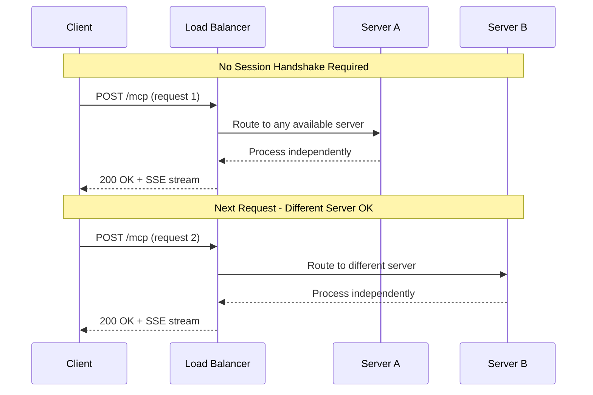

# Calculator Learning Demo - Streamable HTTP Stateless Transport

<div align="center">

[](https://modelcontextprotocol.io)
[](https://www.typescriptlang.org/)
[](LICENSE)
[](https://github.com/modelcontextprotocol/stateless-reference)

</div>

## 🎯 Overview

This repository demonstrates a **learning-edition MCP calculator server using Streamable HTTP transport in stateless mode**. It showcases true serverless architecture with zero server-side state, perfect for edge computing and infinite horizontal scaling.

### Key Characteristics

- **True statelessness**: No `Mcp-Session-Id`, no server-side memory
- **Infinite scalability**: Any server can handle any request
- **Serverless-ready**: Works with AWS Lambda, Vercel, Cloudflare Workers
- **No resumability**: Each request is completely independent
- **Perfect for**: Edge computing, serverless functions, CDN deployment

### Stateless Design Philosophy

The **sessionless design** means all cross-call state must be kept client-side or in external storage. The server treats each request as completely independent, enabling perfect horizontal scaling and zero-downtime deployments.

## 📊 Transport Comparison Table

| Dimension | **STDIO** | **SSE** | **Streamable HTTP** | **Streamable HTTP Stateless** (this) |
|-----------|-----------|---------|---------------------|---------------------------------------|
| **Transport layer** | Local pipes (`stdin`/`stdout`) | 2 × HTTP endpoints (`GET /connect` + `POST /messages`) | Single HTTP endpoint `/mcp` (JSON or SSE) | **Single HTTP endpoint (per request)** |
| **Bidirectional streaming** | ✅ Yes (full duplex) | ⚠️ Server→client only | ✅ Yes (server push + client stream) | ✅ **Within each request** |
| **State management** | Process memory | Server memory (session mapping) | Session-based (`Mcp-Session-Id`) | ❌ **None (stateless)** |
| **Latency** | ⚡ Fastest (microseconds) | 🚀 Good (after connection) | 💫 Moderate (HTTP overhead) | 💫 **Moderate** |
| **Security** | 🔒 Process isolation | 🌐 Network exposed | 🌐 Network exposed | 🌐 **Network exposed** |
| **Scalability** | ⚠️ Single process | ✅ Multi-client | ✅ Horizontal (with sticky sessions) | ♾️ **Infinite (stateless)** |
| **Ideal use case** | Local CLI tools, IDE plugins | Web apps, real-time updates | Enterprise APIs, complex workflows | **Serverless, edge computing** |

## 🔄 Stateless Transport Flow



Each request is completely self-contained with no server-side state dependency. Any server instance can handle any request without coordination.

## 📊 Golden Standard Feature Matrix

| Name | Status | Implementation |
|------|--------|----------------|
| `calculate` | **Core ✅** | Basic arithmetic with streaming support - `{a,b,op,stream?}` signature |
| `batch_calculate` | **NOT_IMPLEMENTED** | Returns JSON-RPC error `-32601` (stateless design doesn't include batch) |
| `advanced_calculate` | **NOT_IMPLEMENTED** | Returns JSON-RPC error `-32601` (not included in minimal stateless demo) |
| `demo_progress` | **Extended ✅** | Emits 5 SSE `progress` events at 200ms intervals, then final result |
| `explain-calculation` | **Core ✅** | Returns Markdown explanation - fully stateless implementation |
| `generate-problems` | **Core ✅** | Returns Markdown practice problems - no state required |
| `calculator-tutor` | **Core ✅** | Returns Markdown tutoring content - stateless prompt generation |
| `solve_math_problem` | **Stub** | Returns `"Available in extended build"` with code `-32004` |
| `explain_formula` | **Stub** | Returns `"Available in extended build"` with code `-32004` |
| `calculator_assistant` | **Stub** | Returns `"Available in extended build"` with code `-32004` |
| `calculator://constants` | **Core ✅** | Static mathematical constants (π, e, φ, √2, ln2, ln10) |
| `calculator://history/{id}` | **Always 404** | Returns `404 Not Found` - no history in stateless mode |
| `calculator://stats` | **Core ✅** | Process uptime only - `{ uptimeMs: process.uptime() * 1000 }` |
| `formulas://library` | **Extended ✅** | Static JSON list of ~10 mathematical formulas |
| `request://current` | **Extended ✅** | Debug resource - echoes HTTP headers & RPC envelope |

**✅ 4 core tools, 3 core prompts, and 3 working resources confirmed in stateless configuration**

## 🚀 Quick Start

### Prerequisites

- Node.js 20.x or higher
- npm or yarn

### Installation

```bash
# Clone the repository
git clone <repository-url>
cd calculator-learning-demo-stateless

# Install dependencies
npm install

# Build the project
npm run build
```

### Running the Server

```bash
# Start the stateless server (port 1071)
npm run start:stateless

# Development mode with auto-reload
npm run dev

# Run as serverless function
npm run start:serverless
```

The server will start on `http://localhost:1071`

## 📋 API Examples

### Basic Calculation (No Session Required)

```bash
curl -N -X POST http://localhost:1071/mcp \
     -H 'Content-Type: application/json' \
     -d '[{
       "jsonrpc": "2.0",
       "id": 1,
       "method": "tools/call",
       "params": {
         "name": "calculate",
         "arguments": {
           "a": 15,
           "b": 7,
           "op": "multiply"
         }
       }
     }]'

# Response:
{"jsonrpc":"2.0","id":1,"result":{"content":[{"type":"text","text":"Result: 105"}]}}
```

### Streaming Calculation

```bash
curl -N -X POST http://localhost:1071/mcp \
     -H 'Content-Type: application/json' \
     -d '[{
       "jsonrpc": "2.0",
       "id": 2,
       "method": "tools/call",
       "params": {
         "name": "calculate",
         "arguments": {
           "a": 100,
           "b": 25,
           "op": "divide",
           "stream": true
         }
       }
     }]'

# Expected SSE output:
event: data
data: {"partial": "Processing..."}

event: data  
data: {"result": 4}
```

### Progress Demonstration

```bash
curl -N -X POST http://localhost:1071/mcp \
     -H 'Content-Type: application/json' \
     -d '[{
       "jsonrpc": "2.0",
       "id": 3,
       "method": "tools/call",
       "params": {
         "name": "demo_progress",
         "arguments": {}
       }
     }]'

# Expected SSE progress events:
event: progress
data: {"progress": 20, "total": 100}

event: progress
data: {"progress": 40, "total": 100}
# ... continues to 100%
```

### Access Resources

```bash
# Get mathematical constants
curl -X POST http://localhost:1071/mcp \
     -H 'Content-Type: application/json' \
     -d '[{
       "jsonrpc": "2.0",
       "id": 4,
       "method": "resources/read",
       "params": {
         "uri": "calculator://constants"
       }
     }]'

# Response:
{"jsonrpc":"2.0","id":4,"result":{"contents":[{"uri":"calculator://constants","mimeType":"application/json","text":"{\"pi\":3.141592653589793,\"e\":2.718281828459045}"}]}}
```

### Use Prompts

```bash
curl -X POST http://localhost:1071/mcp \
     -H 'Content-Type: application/json' \
     -d '[{
       "jsonrpc": "2.0",
       "id": 5,
       "method": "prompts/get",
       "params": {
         "name": "explain-calculation",
         "arguments": {
           "expression": "12 × 8",
           "level": "elementary"
         }
       }
     }]'
```

### Key Difference from Stateful Build

**No sticky conversations** - every call must ship full context. There's no session to maintain, no history to reference, and no state to resume. This enables infinite horizontal scaling but requires clients to manage their own state.

## 🔧 Transport Hardening

### True Statelessness Implementation

- `sessionIdGenerator: () => undefined` in transport constructor
- No server-side transport map or session storage
- No `Mcp-Session-Id` header processing
- Each request processed completely independently

### No Resumability by Design

- No EventStore hooks or event persistence
- `Last-Event-Id` header is ignored
- No `id:` fields in SSE messages
- Stream interruptions require complete request retry

### Single-Endpoint Architecture

- `POST /mcp` - Accept JSON-RPC batch & stream responses
- `GET /mcp` - Optional listen-only channel for unsolicited notifications
- No session-specific endpoints or routing

## 🧪 Testing

```bash
# Run all tests
npm test

# Unit tests - verify stateless behavior
npm run test:unit

# Integration tests - network drop simulation  
npm run test:integration

# Load testing - concurrent requests
npm run test:load

# Manifest compliance
npm run test:manifest
```

### Key Test Scenarios

1. **Stateless Verification**: Confirm no `Mcp-Session-Id` headers in responses
2. **Network Drop Behavior**: Simulate connection loss - expect full retry, not resume
3. **Load Balancer Compatibility**: Concurrent requests to different server instances
4. **Performance Testing**: Load testing with 10,000+ requests
5. **Memory Isolation**: Verify no state leakage between requests

## 📝 State Management

**Critical Design Principle**: All state lives outside the server process.

### What's NOT Stored Server-Side
- ❌ Calculation history
- ❌ User sessions or preferences  
- ❌ Request correlation data
- ❌ Progress state across requests

### What IS Available
- ✅ Process uptime and health status
- ✅ Static resources (constants, formulas)
- ✅ Current request context only
- ✅ Configuration and environment data

This stateless design enables true serverless deployment where instances can start/stop without coordination.

## 🔒 Security Considerations

- **JWT Authentication**: Stateless token validation per request
- **API Key Validation**: Per-request authentication without session storage
- **Reduced Attack Surface**: No session storage means fewer vulnerable state vectors
- **Input Validation**: Zod schemas validate all parameters independently
- **No State Poisoning**: Impossible to corrupt server state between requests

## 📊 Production Features

### Health Checks

```bash
curl http://localhost:1071/health

# Response:
{
  "status": "healthy",
  "timestamp": "2024-01-15T10:30:00Z", 
  "uptime": 3600,
  "version": "1.0.0",
  "transport": "streamable-http-stateless"
}
```

### Serverless Deployment Examples

#### AWS Lambda

```javascript
export const handler = async (event) => {
  // Each Lambda invocation is naturally stateless
  const mpcResponse = await processStatelessRequest(event.body);
  return {
    statusCode: 200,
    headers: {
      'Content-Type': 'application/json',
      'Access-Control-Allow-Origin': '*'
    },
    body: mpcResponse
  };
};
```

#### Cloudflare Workers  

```javascript
export default {
  async fetch(request) {
    // Perfect for edge deployment
    const body = await request.json();
    const response = await handleStatelessMCP(body);
    
    return new Response(response, {
      headers: {
        'Content-Type': 'application/json',
        'Cache-Control': 'no-cache'
      }
    });
  }
};
```

### Scaling Characteristics

- **Horizontal scaling**: ♾️ Infinite (no session affinity required)
- **Cold start time**: Optimized for < 100ms startup
- **Memory footprint**: < 128MB per instance
- **Request size limit**: 1MB maximum payload
- **Load balancer agnostic**: Any algorithm works (round-robin, least-connections, etc.)

## 📖 Resources

- [MCP Specification](https://spec.modelcontextprotocol.io)
- [Model Context Protocol Documentation](https://modelcontextprotocol.io)
- [Streamable HTTP Transport](https://spec.modelcontextprotocol.io/specification/basic/transports/#streamable-http)
- [Serverless Architecture Best Practices](https://12factor.net/)

## 📝 License

This project is licensed under the MIT License - see the [LICENSE](LICENSE) file for details.

---

<p align="center">
  ✅ <strong>Stateless Reference Implementation - MCP Learning Edition</strong><br/>
  Perfect horizontal scaling with zero server-side state dependencies
</p>