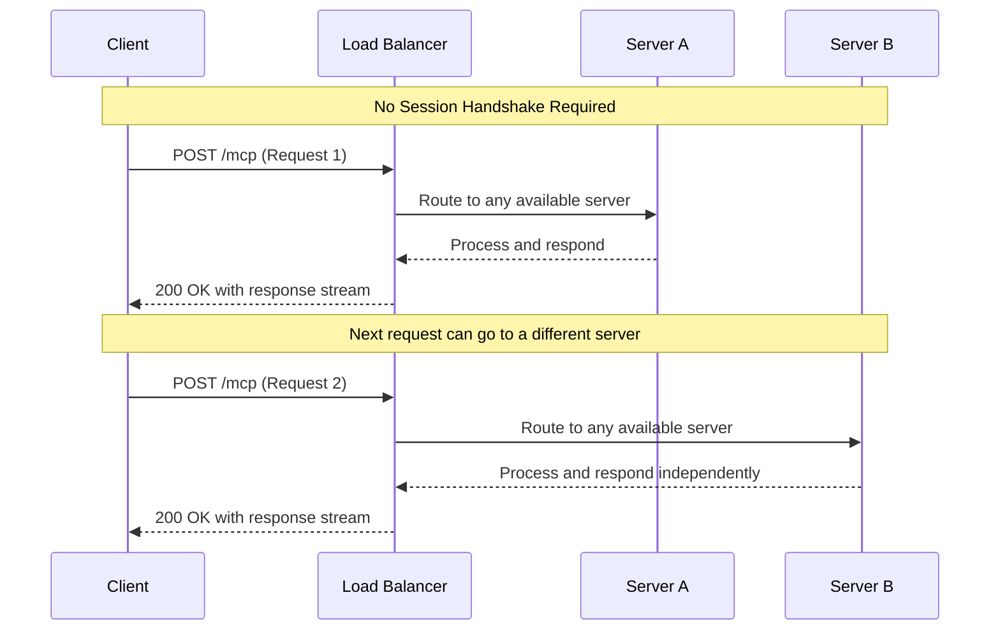

# Calculator Learning Demo - Streamable HTTP (Stateless) Transport

<div align="center">

[](https://modelcontextprotocol.io)
[](https://www.typescriptlang.org/)
[](https://spec.modelcontextprotocol.io/specification/basic/transports/#streamable-http)
[](LICENSE)

</div>

## 🎯 Overview

This repository provides a reference implementation of an **MCP calculator server using Streamable HTTP transport in a truly stateless mode**. It is architected for maximum scalability and is optimized for serverless and edge computing environments.

The core design principle is that the server holds **zero state** between requests. Every incoming request is atomic and self-contained. This design choice enables perfect horizontal scaling and eliminates an entire class of state-related complexities and vulnerabilities.

### Key Characteristics

-   **Zero State Persistence**: The server retains no memory of past requests. No sessions, no history.
-   **Per-Request Lifecycle**: A new MCP server instance is created for every HTTP request and is destroyed immediately after the response stream closes.
-   **Infinite Scalability**: Since no state is shared, any server instance in a cluster can handle any request, making load balancing trivial (e.g., round-robin).
-   **No Resumability**: By design, if a connection is lost, the client must initiate a completely new request. There is no session to resume.
-   **Ideal Use Case**: Edge functions (Vercel, Cloudflare), serverless computing (AWS Lambda), and any application where horizontal scalability is paramount.

## 📊 Transport Comparison

This table compares the four primary MCP transport mechanisms. The implementation in **this repository is highlighted**.

| Dimension | STDIO | SSE (Legacy) | Streamable HTTP (Stateful) | **Streamable HTTP (Stateless)** |
|:-----------|:-----------|:---------|:---------------------|:-------------------------------|
| **Transport Layer** | Local Pipes (`stdin`/`stdout`) | 2 × HTTP endpoints (`GET`+`POST`) | Single HTTP endpoint `/mcp` | ✅ **Single HTTP endpoint `/mcp`** |
| **Bidirectional Stream** | ✅ Yes (full duplex) | ⚠️ Server→Client only | ✅ Yes (server push + client stream) | ✅ **Yes (within each request)** |
| **State Management** | Ephemeral (Process Memory) | Ephemeral (Session Memory) | Persistent (Session State) | ❌ **None (Stateless)** |
| **Resumability** | ❌ None | ❌ None | ✅ Yes (`Last-Event-Id`) | ❌ **None (by design)** |
| **Scalability** | ⚠️ Single Process | ✅ Multi-Client | ✅ Horizontal (Sticky Sessions) | ♾️ **Infinite (Serverless)** |
| **Security** | 🔒 Process Isolation | 🌐 Network Exposed | 🌐 Network Exposed | 🌐 **Network Exposed** |
| **Ideal Use Case** | CLI Tools, IDE Plugins | Legacy Web Apps | Enterprise APIs, Workflows | ✅ **Serverless, Edge Functions** |

## 📐 Architecture and Flow

The stateless transport treats every request as a new, independent interaction. A fresh MCP server instance is created for each incoming request and destroyed once the response is complete. This eliminates the need for session management and allows any server in a cluster to handle any request.



The core of this architecture is the `handleMCPRequest` function in `stateless-production-server.ts`, which performs the following for every call:
1.  Creates a new `McpServer` instance using the `createMCPServer` factory.
2.  Creates a new `StreamableHTTPServerTransport` configured for stateless operation (`sessionIdGenerator: undefined`).
3.  Connects the server and transport.
4.  Processes the HTTP request and streams the response.
5.  Listens for the `response.on('close', ...)` event to tear down and garbage-collect both the server and transport instances.

## ✨ Feature Compliance

This server implements a minimal, stateless version of the MCP Latest Standard. Features requiring state are explicitly not implemented.

| Name | Status | Implementation |
|:------|:--------|:----------------|
| `calculate` | **Core ✅** | Basic arithmetic with optional streaming progress. |
| `batch_calculate` | **Not Implemented** | Returns error `-32601`, as this is not part of the stateless demo. |
| `advanced_calculate`| **Not Implemented** | Returns error `-32601`, not included in this build. |
| `demo_progress` | **Extended ✅** | Emits 5 SSE `progress` events, then the final result. |
| `explain-calculation`| **Core ✅** | Returns a stateless Markdown explanation. |
| `generate-problems` | **Core ✅** | Returns stateless Markdown practice problems. |
| `calculator-tutor` | **Core ✅** | Returns stateless Markdown tutoring content. |
| `solve_math_problem`| **Stub** | Returns error `-32004 Available in extended build`. |
| `explain_formula` | **Stub** | Returns error `-32004 Available in extended build`. |
| `calculator_assistant`| **Stub** | Returns error `-32004 Available in extended build`. |
| `calculator://constants`| **Core ✅** | Resource for static mathematical constants. |
| `calculator://history/{id}`| **Not Implemented** | Always returns a `404 Not Found` error. |
| `calculator://stats`| **Core ✅** | Resource for process uptime only; no request counters. |
| `formulas://library`| **Extended ✅** | Resource for a static list of mathematical formulas. |
| `request://current`| **Extended ✅**| Debug resource that echoes current request info. |

## 🚀 Getting Started

### Prerequisites

*   Node.js (v20.x or higher)
*   npm or yarn

### Installation

```bash
# Clone the repository
git clone https://github.com/modelcontextprotocol/mcp-server-examples.git
cd mcp-server-examples/streamable-http-stateless

# Install dependencies
npm install

# Build the project
npm run build
```

### Running the Server

```bash
# Start the stateless server on port 1071
npm run start:stateless

# Or, run in development mode with auto-reload
npm run dev
```

### Testing with MCP Inspector

You can interact with the running server using the official MCP Inspector CLI. Ensure the server is running first.

```bash
# The CLI will connect to the server and list its capabilities
npx @modelcontextprotocol/inspector http://localhost:1071/mcp
```

## 📋 API Usage Examples

All requests are made to the single `/mcp` endpoint. No session headers are required.

### Basic Calculation

```bash
curl -X POST http://localhost:1071/mcp \
     -H 'Content-Type: application/json' \
     -d '[{
       "jsonrpc": "2.0",
       "id": "req-1",
       "method": "tools/call",
       "params": {
         "name": "calculate",
         "arguments": { "a": 100, "b": 5, "op": "divide", "precision": 4 }
       }
     }]'

# Response:
# {"jsonrpc":"2.0","id":"req-1","result":{"content":[{"type":"text","text":"DIVIDE: 100 ÷ 5 = 20\n\nSteps:\nInput: 100 divide 5\nDivision: 100 ÷ 5 = 20\nFinal result (4 decimal places): 20"}],"metadata":{...}}}
```

### Streaming Progress Demonstration

Use the `-N` (no-buffering) flag with `curl` to see the Server-Sent Events (SSE) as they arrive.

```bash
curl -N -X POST http://localhost:1071/mcp \
     -H 'Content-Type: application/json' \
     -d '[{
       "jsonrpc": "2.0",
       "id": "req-2",
       "method": "tools/call",
       "params": {
         "name": "demo_progress",
         "arguments": {}
       }
     }]'

# Expected SSE stream output (events arrive over 1 second):
# event: progress
# data: {"progressToken":"...","progress":0.2,"level":"info","data":"Progress step 1 of 5"}
#
# event: progress
# data: {"progressToken":"...","progress":0.4,"level":"info","data":"Progress step 2 of 5"}
#
# event: progress
# data: {"progressToken":"...","progress":0.6,"level":"info","data":"Progress step 3 of 5"}
#
# event: progress
# data: {"progressToken":"...","progress":0.8,"level":"info","data":"Progress step 4 of 5"}
#
# event: progress
# data: {"progressToken":"...","progress":1,"level":"info","data":"Progress step 5 of 5"}
#
# event: data
# data: {"jsonrpc":"2.0","id":"req-2","result":{"content":[{"type":"text","text":"Progress demonstration completed with 5 steps"}]}}
```

## 🧠 State Management Model

**This server is explicitly stateless.** All state required to process a request must be contained within the request itself. The server does not and cannot retain information between requests.

#### What IS NOT Stored Server-Side
-   ❌ **Calculation History**: The server has no memory of past calculations.
-   ❌ **User Sessions**: There is no concept of a user session.
-   ❌ **Request Correlation**: The server does not link multiple requests together.

#### What IS Available (Per-Process or Per-Request)
-   ✅ **Process Uptime**: Accessible via the `calculator://stats` resource. This is global to the Node.js process, not a specific request.
-   ✅ **Static Resources**: The `calculator://constants` and `formulas://library` resources are read from static definitions on each call.
-   ✅ **Request Context**: The server has access to the current HTTP request headers and body, but only for the duration of that single request.

## 🛡️ Security Model

A stateless architecture changes the security model by eliminating session-based vulnerabilities.

-   **No Session Hijacking**: Since there are no sessions, they cannot be hijacked.
-   **Per-Request Authentication**: Security is handled on a per-request basis. In a production scenario, you would add middleware to validate an `Authorization` header containing a stateless token (e.g., JWT) on every call.
-   **Reduced Attack Surface**: The absence of server-side state storage reduces the potential for state-based attacks like data corruption or information leakage between sessions.
-   **Input Validation**: All parameters are rigorously validated on every request using Zod schemas, preventing malformed data from propagating.

## 🧪 Testing

This project includes a test suite verifying its stateless behavior.

```bash
# Run all available tests
npm test

# Run tests with a code coverage report
npm run test:coverage

# Run tests in watch mode for development
npm run test:watch
```

## Production-Ready Features

This server includes several features designed for observability in a production environment.

### Structured Logging

All console output is structured JSON, including a unique `requestId` to correlate all logs associated with a single HTTP request. This is essential for debugging in a distributed, serverless environment.

**Example Log Entry:**
```json
{"timestamp":"2023-10-27T18:30:00.000Z","level":"info","message":"Created fresh MCP server instance","context":{"requestId":"..."}}
```

### Monitoring & Health Checks

The server exposes several endpoints for monitoring and health checks:

| Endpoint | Method | Description |
|:---|:---|:---|
| `/health` | `GET` | A simple health check, returns status `healthy`. |
| `/health/detailed` | `GET` | Provides detailed system, application, and characteristic info. |
| `/metrics` | `GET` | Exposes basic metrics in a Prometheus-compatible format. |

**Example Health Check:**
```bash
curl -s http://localhost:1071/health | jq
{
  "status": "healthy",
  "timestamp": "2023-10-27T18:35:00.000Z",
  "pattern": "stateless",
  "uptime": 300.123,
  "memory": { "rss": 50123456, ... },
  "version": "1.0.0"
}
```

## 📚 Official Resources

*   [MCP Specification](https://spec.modelcontextprotocol.io)
*   [Model Context Protocol Documentation](https://modelcontextprotocol.io)
*   [Streamable HTTP Transport Documentation](https://spec.modelcontextprotocol.io/specification/basic/transports/#streamable-http)